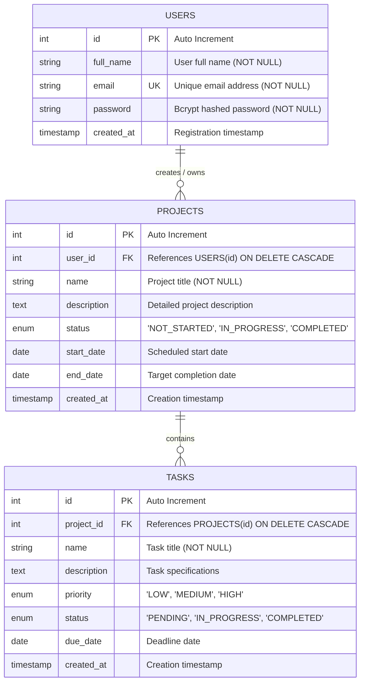

# Entity-Relationship (ER) Diagram

This document models the database structure of the **Project Management System**.

## Mermaid ER Diagram

## Entity Details & Cardinality

### 1. `users` Table
- **Primary Key**: `id` (`INT AUTO_INCREMENT`)
- **Attributes**:
  - `full_name` (`VARCHAR(255)`): Stored display name of the user.
  - `email` (`VARCHAR(255)`): Unique credential used for logging in.
  - `password` (`VARCHAR(255)`): Stored strictly as a bcrypt hash (`$2b$10$...`). Never plain text.
  - `created_at` (`TIMESTAMP`): Defaults to current timestamp.
- **Relationships**:
  - `1 : N` with `projects`: A user can own 0, 1, or multiple projects.

### 2. `projects` Table
- **Primary Key**: `id` (`INT AUTO_INCREMENT`)
- **Foreign Key**: `user_id` references `users(id)` with `ON DELETE CASCADE`.
- **Attributes**:
  - `name` (`VARCHAR(255)`): Title of the project.
  - `description` (`TEXT`): Overview and scope of the project.
  - `status` (`ENUM`): Limited to `NOT_STARTED`, `IN_PROGRESS`, `COMPLETED`.
  - `start_date` (`DATE`): Optional start date.
  - `end_date` (`DATE`): Optional target completion date.
  - `created_at` (`TIMESTAMP`): Defaults to current timestamp.
- **Indexes**:
  - Index on `user_id` for fast query filtering by owner.
  - Index on `status` for fast status-filtered queries.
- **Relationships**:
  - `N : 1` with `users`: Each project belongs to exactly one user.
  - `1 : N` with `tasks`: A project can contain 0, 1, or multiple tasks.

### 3. `tasks` Table
- **Primary Key**: `id` (`INT AUTO_INCREMENT`)
- **Foreign Key**: `project_id` references `projects(id)` with `ON DELETE CASCADE`.
- **Attributes**:
  - `name` (`VARCHAR(255)`): Task name / objective.
  - `description` (`TEXT`): Detailed instructions or notes.
  - `priority` (`ENUM`): Priority level: `LOW`, `MEDIUM`, `HIGH`.
  - `status` (`ENUM`): Workflow state: `PENDING`, `IN_PROGRESS`, `COMPLETED`.
  - `due_date` (`DATE`): Due date deadline.
  - `created_at` (`TIMESTAMP`): Defaults to current timestamp.
- **Indexes**:
  - Index on `project_id` for fast task lookup by project.
  - Index on `status` and `priority` for filtered views.
- **Relationships**:
  - `N : 1` with `projects`: Each task belongs to exactly one project.

## Authorization and Data Isolation Rules
1. **Ownership Constraint**: All queries to `projects` MUST include `WHERE user_id = ?` using the verified `user.id` from the JWT token.
2. **Cascading Authorization for Tasks**: Any operation on `tasks` must join or verify through `projects` to ensure `projects.user_id = ?`. Users cannot read, edit, or delete tasks belonging to another user's projects.
3. **Referential Integrity**: When a user is removed, all their projects and corresponding tasks are automatically deleted via `ON DELETE CASCADE`. When a project is removed, its associated tasks are automatically purged.
